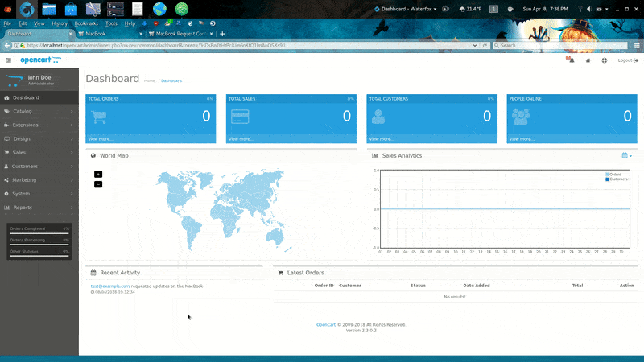
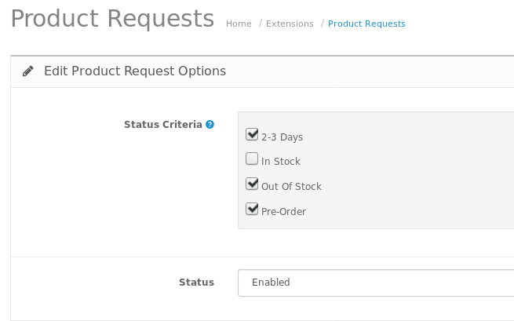
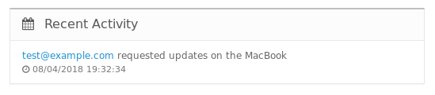
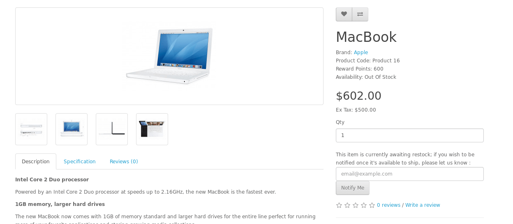
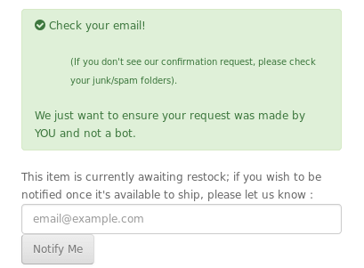

# Product Requests for Open Cart v 1.0.1
For Open Cart 2.3.0.2

Increase customer retention and sales by opening a direct line of communication regarding backordered and out of stock products; gauge knowledge on which products should be prioritized when restocking your store.

For a list of improvements & fixes, see the [changelog](CHANGELOG.md).

Features
* Self-extracting in OCMOD format
* Quick configuration (2 options!)
* Built-in honeypot validation to thwart bots
* Tokenized email confirmations sent to the user to confirm they requested the notification; helps reduce spam and FBL complaints
* No technical skill required for use

***

## [:link: Install Instructions](installing-instructions.md) ##

## [:link: Upgrade Instructions](upgrade-instructions.md) ##

***

## Usage ##

Once installed and configured, the system automatically will detect whether or not a box is displayed on a product, based on the settings you configured in your dashboard.

(optional) You can customize the verbiage of what your customers see by editing the language files:
[front end product_request.php](./upload/catalog/language/en-gb/extension/module/product_request.php) and [back end product_request.php](./upload/admin/language/en-gb/extension/module/product_request.php)

Built-in spam protection, requiring users validate their request by visiting a tokenized link, unique to their request -- helps reduce spam & feedback-loop complaints.

Example of the confirmation sent to a user requesting a product notification:
> Just a quick note to confirm that you requested an update once MacBook is available for purchase.
>
> If you did not make this request; simply ignore it and you will not be subscribed to this product. However, if you wish to confirm your request, please do so via:
>  `https://yoursite/index.php?route=product/notify&confirm=3e999c120d9037ba2445c643`
>
> Please note that you will receive an email once this item is available for purchase; it doesn't place the item on hold for you. Stock is available on a first come, first serve basis.
>
> Thanks for your interest in our merchandise!
>
> Your Name
> `https://yoursite`

### Things to consider ###
This is a powerful extension with a lot of functionality.  It is highly recommended you install it to a development version of your site, before installing it to your live store - to ensure there are no collisions with other extensions.

### Note ###
You do not need to clone this repository to utilize the plugin, all you have to do is download the
[zip file](./../../releases).

You can also get it from the [Open Cart Marketplace](https://www.opencart.com/index.php?route=marketplace/extension/info&extension_id=33761)

I included the source in this repository for those who like to review the codebase prior to using new code.

### Language Info ###
The language the email is sent to the recipient in, is dependent upon the language of their 'profile' as they visited the site (which is typically the default language of the front-end of your store.)

If you would like to contribute a new language pack, please see [contributing info](CONTRIBUTING.md).
