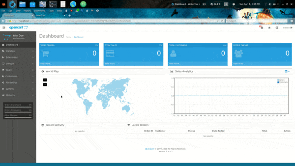

# Install Instructions

**This plugin is not compatible with the release candidiate version of 2.3.0.2_rc; ensure you are running 2.3.0.2 by checking the footer of your admin panel for the version number.**

If you already have the extension installed & will be upgrading to a new release, follow the [upgrade instructions](upgrade-instructions.md), instead.

* Download the .zip file and in admin (left navigation menu) -> Extensions Installer

* Click Upload & select the .zip

* Clear Modifications cache (orange button, then blue button on the right)

* Enable Product Request Extension by going to Extensions (left navigation menu; then clicking the green button to the right of Product Requests)

* Once installed, the blue edit button will be click-able.  Click that to enter the configuration page.

Once on the configuration page, you can select with stock statuses will trigger the request box to be shown.  Don't forget to select "Enable" to activate the plugin!
